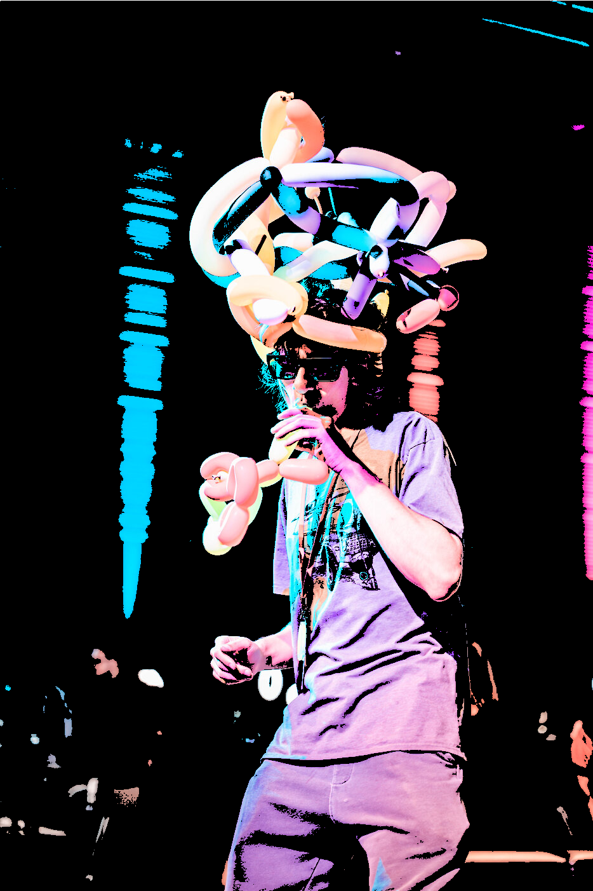

# Creating a filter for images using p5js

## _showing the image_

### _1. pre-load your image_

```js
let img;

function preload() {
    img = loadImage("./loic.png");
}
```

### _2. set a the size of your image_

```js
function setup() {
    createCanvas(img.width, img.height);
}
```

### _3. draw your image by changing the canvas pixels color value_

#### _load both of the pixels arrays_

```js
function setup() {
    // ...

    img.loadPixels();
    loadPixels();
}
```

#### _loop through the pixels array based on the width & height_

```js
function setup() {
    // ...

    for (let x = 0; x < width; x++) {
        for (let y = 0; y < height; y++) {
            // ...
        }
    }
}
```

#### _get the index of the pixel using the density of pixels_

```js

function setup() {
    // ...
    let d = pixelDensity();

    for (let x = 0; x < width; x++) {
        for (let y = 0; y < height; y++) {
            let index = 4 * ((d + y) * width * d + (d + x));
            // ...
        }
    }
}
```

#### _get the r, g, b and a value of the pixel of the image_

```js
function setup() {
    // ...
    let d = pixelDensity();

    for (let x = 0; x < width; x++) {
        for (let y = 0; y < height; y++) {
            let index = 4 * ((d + y) * width * d + (d + x));
            let r = img.pixels[index];
            let g = img.pixels[index + 1];
            let b = img.pixels[index + 2];
            let a = img.pixels[index + 3];
            // ...
        }
    }
}
```

#### _change the color of the pixel of the canvas_

```js
function setup() {
    // ...
    let d = pixelDensity();

    for (let x = 0; x < width; x++) {
        for (let y = 0; y < height; y++) {
            let index = 4 * ((d + y) * width * d + (d + x));
            let r = img.pixels[index];
            let g = img.pixels[index + 1];
            let b = img.pixels[index + 2];
            let a = img.pixels[index + 3];

            pixels[index] = r;
            pixels[index + 1] = g;
            pixels[index + 2] = b;
            pixels[index + 3] = a;
        }
    }
}
```

#### _update the canvas pixels_

```js
function setup() {
    // ...
    let d = pixelDensity();

    for (let x = 0; x < width; x++) {
        for (let y = 0; y < height; y++) {
            let index = 4 * ((d + y) * width * d + (d + x));
            let r = img.pixels[index];
            let g = img.pixels[index + 1];
            let b = img.pixels[index + 2];
            let a = img.pixels[index + 3];

            pixels[index] = r;
            pixels[index + 1] = g;
            pixels[index + 2] = b;
            pixels[index + 3] = a;
        }
    }

    updatePixels();
}
```

## _adding a chromatic effect/filter to the render_


### _1. create a variable to store the chromatic value_

#### _value calculated by using the brightness of the pixels, so to result 1 value from 3 (r, g, b) we must calculate the average of the 3 values_

```js
const cumulative = (r + g + b) / 3;
```

#### _update the existing code within the loops to use the new chromatic value for each of the rgb channel_

```js
function setup() {
    // ...
    for (let x = 0; x < width; x++) {
        for (let y = 0; y < height; y++) {
            // ...

            pixels[index] = cumulative;
            pixels[index + 1] = cumulative;
            pixels[index + 2] = cumulative;
            pixels[index + 3] = a;
        }
    }
    // ...
}
```


### _3. add a threshold at which the pixel will be either black or white_


```js
// 0 = black
// 255 = white

const threshold = 150;
cumulative = cumulative > threshold ? 255 : 0;
```


### _4. smoothen the bright part of the threshold by mapping it's original values to a given range_

```js
const threshold = 150;
cumulative = cumulative > threshold ? map(cumulative, 150, 255, 50, 255) : 0;
```

#### _which will result in a clearer image_


## _now lets make the image be "glitched"_

#### _now instead of setting a value to each canvas pixels directly, lets create points and draw those with the proper color_

```js
function setup() {
    // ...

    loadPixels(); // line removed

    for (let x = 0; x < width; x++) {
        for (let y = 0; y < height; y++) {
            // ...

            stroke(cumulative, a);
            point(x, y);

            pixels[index] = cumulative; // line removed
            pixels[index + 1] = cumulative; // line removed
            pixels[index + 2] = cumulative; // line removed
            pixels[index + 3] = a; // line removed
        }
    }
    
    updatePixels(); // line removed
}
```

#### _add a bit of randomness to the size of the points_

```js
function setup() {
    // ...

    for (let x = 0; x < width; x++) {
        for (let y = 0; y < height; y++) {
            // ...

            strokeWeight(random(3, 5));
            stroke(cumulative, a);
            point(x, y);
        }
    }
}
```

#### _change the points to lines and set the second x to the current x + a random amount_

```js
const lineHalfMaxLength = 100;

function setup() {
    // ...
    
    for (let x = 0; x < width; x++) {
        for (let y = 0; y < height; y++) {
            // ...

            strokeWeight(random(3, 5));
            stroke(cumulative, a);
            line(x, y, x + random(-lineHalfMaxLength, lineHalfMaxLength), y);
            point(i, j); // line removed
        }
    }
}
```


## _other variant_

#### _lets use the color of the image and only apply it to the pixels where the chromatic value is higher then the threshold_

```js
const threshold = 150;
let img;

function preload() {
    img = loadImage("loic.jpeg");
}

function setup() {
    createCanvas(img.width, img.height);

    img.loadPixels();
    loadPixels();

    let d = pixelDensity();

    for (let x = 0; x < width; x++) {
        for (let y = 0; y < height; y++) {
            const index = 4 * ((d + y) * width * d + (d + x));
            const r = img.pixels[index];
            const g = img.pixels[index + 1];
            const b = img.pixels[index + 2];
            const a = img.pixels[index + 3];

            const cumulative = (r + g + b) / 3;

            if (cumulative > threshold) {
                pixels[index] = img.pixels[index];
                pixels[index + 1] = img.pixels[index + 1];
                pixels[index + 2] = img.pixels[index + 2];
            } else {
                pixels[index] = 0;
                pixels[index + 1] = 0;
                pixels[index + 2] = 0;
            }
            pixels[index + 3] = a;
        }
    }

    updatePixels();
}
```



## _now what? SHADER???_

#### why, well currently our filter is running on the CPU, which is really powerfull but can't do a lot of process/calculation all at once. So instead we can convert our code/filter to be ran on the GPU which is not as powerful as the CPU but allow for a lot more processes to be ran at once

we first need to create a shader file, which will be used to run our filter on the GPU

create a `shader.vert` file (vertex shader) that will contain a main function
```glsl
// vertex shader
void main() {
    // ...
}
```

the vertex shader will be used to define the position of the pixels on the canvas that we want to update the color for

set the position in the vertex shader
```glsl
// vertex shader
attribute vec3 aPosition;

void main() {
    gl_Position = vec4(aPosition, 1.0);
}
```

we have now introduced a new variable `aPosition` which will be used to set the position of the pixels on the canvas

note that this variable is provided by p5js when using the `shader()` function

create a `shader.frag` file (fragment shader) that will also contain a main function
```glsl
// fragment shader
void main() {
    // ...
}
```

the fragment shader will be used to define the color of the pixels on the canvas that we want to update

set the color in the fragment shader
```glsl
// fragment shader
void main() {
    gl_FragColor = vec4(1.0, 0.0, 0.0, 1.0);
}
```

we have now set the color of the pixels to red for each pixels

now lets update our sketch to use those new shaders

```js
let img;
let shd;

function preload() {
  img = loadImage("./loic.jpeg");
  shd = loadShader('shader.vert', 'shader.frag');
}

function setup() {
  createCanvas(img.width, img.height, WEBGL);
}

function draw() {
  shader(shd);
  rect(-(width / 2), -(height / 2), width, height);
}
```

as we can see we have change the rendering mode to WEBGL, which will allow us to use shaders
```js
createCanvas(img.width, img.height, WEBGL);
```

by the same fact this as set the origin of our canvas to the center

we then specify which shader to use in the draw loop
```js
shader(shd);
```

and finally we draw a rectangle that will be used to render the shader
```js
rect(-(width / 2), -(height / 2), width, height);
```

looking at the result we can see that the shader is applied to the canvas, but only a quarter of it is red...


this is because the vertex shader start at the center of the canvas, so we need to update the position of the vertex to start at the bottom left corner of the canvas

```glsl
// vertex shader
attribute vec3 aPosition;

void main() {
  vec4 positionVec4 = vec4(aPosition, 1.0);
  // * 2 is to use the full canvas size
  // - 1 is to place it back to a new origin (from the center to the bottom left)
  positionVec4.xy = (positionVec4.xy * 2.0) - 1.0;
  gl_Position = positionVec4;
}
```

now looking at the result we can see that the shader is applied to the full canvas


ok now that we have the canvas setup to use the shader let's add back our image using the shader

first define a new uniform called u_texture that will be used to pass the image to the shader
```js
function draw() {
    shader(shd);
    shd.setUniform('u_resolution', [width, height]);
    shd.setUniform('u_texture', img);
    rect(-(width / 2), -(height / 2), width, height);
}
```

notice that we also defined a resolution for the shader, which will be used to calculate the position of the pixels on the canvas

afterwhich we need to update the fragment shader to use the image

```glsl
// fragment shader
uniform vec2 u_resolution;
uniform sampler2D u_texture;

void main() {
    vec2 uv = gl_FragCoord.xy / u_resolution.xy;
    vec4 color = texture2D(u_texture, uv);
    gl_FragColor = color;
}
```

now looking at the result we can see that the shader rendering our image


one obvious issue is that the image is flipped, this is because the origin of the canvas is now at the bottom left corner instead of the top left corner

we can correct that by flipping the y axis

```glsl
// fragment shader
uniform vec2 u_resolution;
uniform sampler2D u_texture;

void main() {
    vec2 uv = gl_FragCoord.xy / u_resolution.xy;
    uv.y = 1.0 - uv.y; // flip the y axis
    vec4 color = texture2D(u_texture, uv);
    gl_FragColor = color;
}
```


ok we are pretty much back to where we were at the start, now let's add back the chromatic effect

```glsl
// fragment shader
uniform vec2 u_resolution;
uniform sampler2D u_texture;

void main() {
    vec2 uv = gl_FragCoord.xy / u_resolution.xy;
    uv.y = 1.0 - uv.y; // flip the y axis
    vec4 color = texture2D(u_texture, uv);

    float cumulative = (color.r + color.g + color.b) / 3.0;

    gl_FragColor = vec4(cumulative, cumulative, cumulative, 1.0);
}
```


now let's add back the threshold

```glsl
// fragment shader
uniform vec2 u_resolution;
uniform sampler2D u_texture;

void main() {
    vec2 uv = gl_FragCoord.xy / u_resolution.xy;
    uv.y = 1.0 - uv.y; // flip the y axis
    vec4 color = texture2D(u_texture, uv);

    float cumulative = (color.r + color.g + color.b) / 3.0;

    float treshold = 0.5;
    cumulative = cumulative > treshold ? 1.0 : 0.0;

    gl_FragColor = vec4(cumulative, cumulative, cumulative, 1.0);
}
```


now let's add back the smoothening of the bright part of the threshold

```glsl
// fragment shader
uniform vec2 u_resolution;
uniform sampler2D u_texture;

void main() {
    vec2 uv = gl_FragCoord.xy / u_resolution.xy;
    uv.y = 1.0 - uv.y; // flip the y axis
    vec4 color = texture2D(u_texture, uv);

    float cumulative = (color.r + color.g + color.b) / 3.0;

    float treshold = 0.5;
    cumulative = cumulative > treshold ? smoothstep(treshold, 1.0, cumulative) : 0.0;

    gl_FragColor = vec4(cumulative, cumulative, cumulative, 1.0);
}
```


now I also want the treshold to be dynamic, so let's add a uniform for it

```js
function draw() {
    // ...
    shd.setUniform('u_treshold', 0.5);
    // ...
}
```

```glsl
// fragment shader
uniform vec2 u_resolution;
uniform sampler2D u_texture;
uniform float u_treshold;

void main() {
    vec2 uv = gl_FragCoord.xy / u_resolution.xy;
    uv.y = 1.0 - uv.y; // flip the y axis
    vec4 color = texture2D(u_texture, uv);

    float cumulative = (color.r + color.g + color.b) / 3.0;

    cumulative = cumulative > u_treshold ? smoothstep(u_treshold, 1.0, cumulative) : 0.0;

    gl_FragColor = vec4(cumulative, cumulative, cumulative, 1.0);
}
```

If you want to play around with the code, you can find it here: https://editor.p5js.org/ricoloic/sketches/8xJ1ZF2kwb
